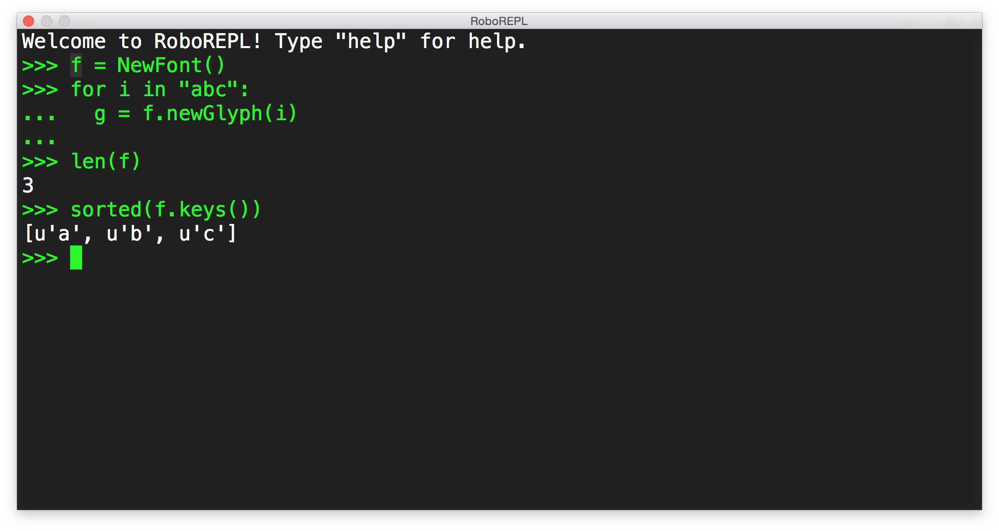

# RoboREPL

A Python [REPL](https://en.wikipedia.org/wiki/Read–eval–print_loop) in RoboFont.

> What?

You know, an interactive Python interpreter.

> Why?

Because sometimes we need to write a little code.

> But, um, there's the scripting window?

Yes. I'm talking about a *little* code. You know, something quick that doesn't warrant the full script rigmarole.

> Okay. You're weird.

Whatever.

> ...

> ...

> ...

> Okay. I kind of see the point, but this readme is **extremely unhelpful**.

At the prompt, type `help`. Documentation is there.

> The interface is ugly. It should use...

Type `settings.help` and you'll get info about switching the fonts. It's easy.

> The colors...

`settings.help`

> Wait, I want to change...

`settings.help`

> No, I want...

`settings.help`

> Weirdo.

> ...

> ...

> ...

> How do I clear the window?

 ⌘K

> Whatever.

> ...

> ...

> ...

> I found a bug.

Yeah, probably. I wrote this thing pretty fast so there are bound to be some problems. Here are the changes I've made in each of the releases. Maybe your bug has been already fixed?

##### 0.4 (not yet released)

- Implemented auto completion. Use the ESC key to bring up suggestions.

##### 0.3

- ⌘C with no selection will copy the latest stdout/stderr output to the pasteboard.
- Key commands are defined in `help`.
- Fixed an opacity bug that appeared in transparent windows.
- ⇧+TAB will delete one level of indentation preceding the cursor.
- The window can be resized with a mouse drag.
- Invisible characters can be shown with `settings.showInvisibleCharacters = True`. This relies on the invisible characters being defined in the font. You probably designed the font you are using, so supporting that is your business.
- Dropping paths from the Finder into the window will format the incoming paths as strings/lists of strings.
- Put a little lead between lines.

##### 0.2

- Fixed an issue with OS X's magic replacement of smart quotes, dashes and other stuff.
- Fixed a bug in `settings.saveTheme("something")`.

##### 0.1

- Initial release.

> Nope. Your thing is still broken.

Got it. The best thing to do is [open an issue](https://github.com/typesupply/roborepl/issues).

> Nah. I'll email you or hit you up on the Twitterbook.

No, really, please open an issue. I'm forgetful so I need them in a standard place.

> I'm not signing up for a GitHub account just to tell you that your stupid thing is broken!

Alright. Email me or hit me up on Instawitter, I guess. Please don't get mad if I forget it.

> Oh, don't worry, I'll email you about it non-stop until it's fixed.

Please don't.